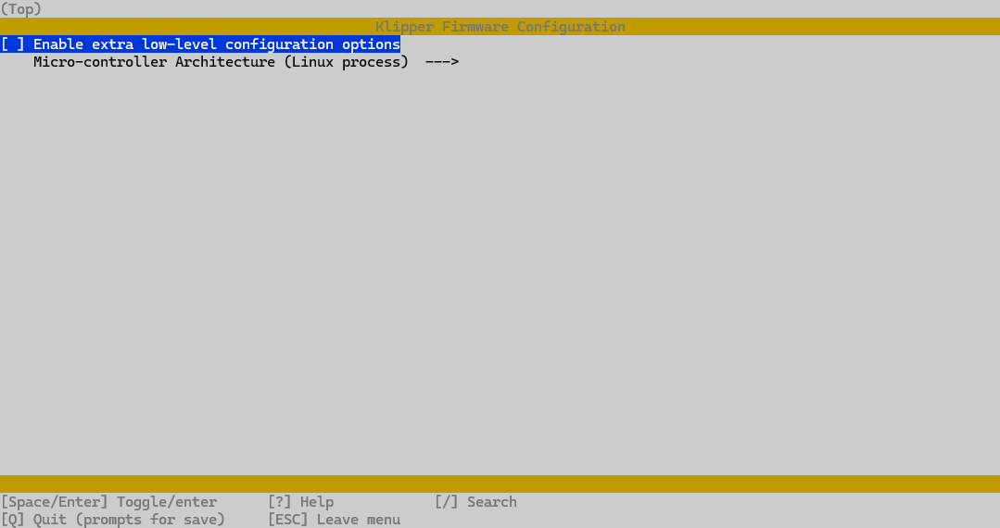
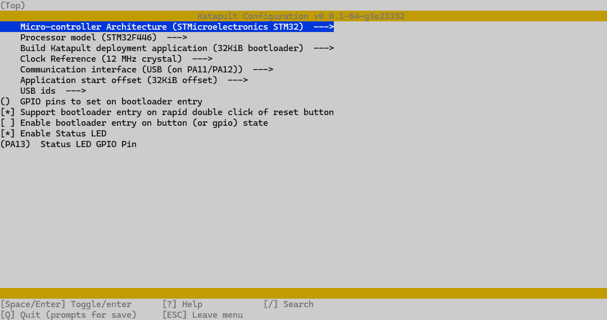
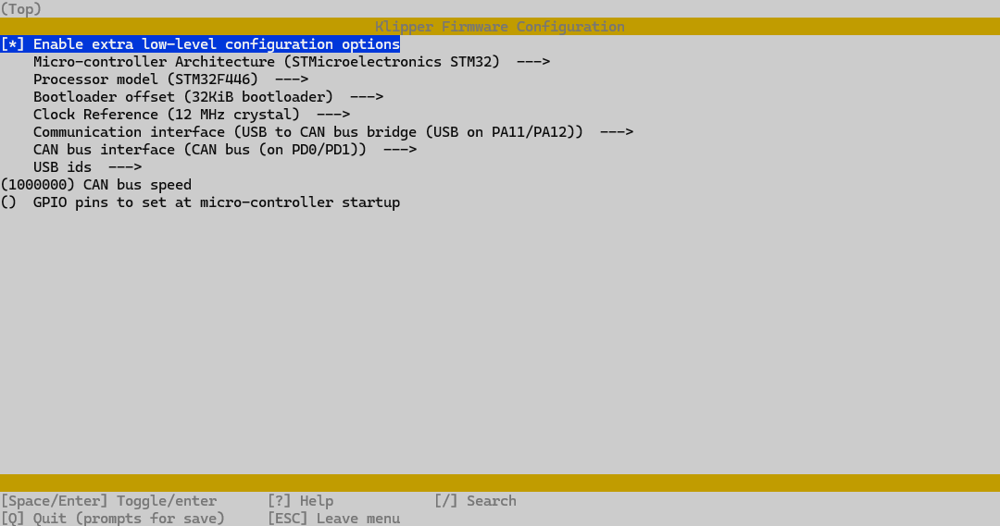

# Klipper from scratch

My condensed guide installating klipper from scratch on a new sd card.

I only include the instructions applicable to me and the hardware I have but
maybe this would be helpful as a crib sheet for yourself.

My klipper backups are

- [Voron 2.4](https://github.com/richardjm/voronpi-klipper-backup)
- [Crucible](https://github.com/richardjm/crucible-klipper-backup)

## Backup existing sd card

Use [Win32 Disk Imager](https://sourceforge.net/projects/win32diskimager/) to
"read" your sdcard to a new `.img` file on disk.

## Flash and install latest Raspbian

Simple enough just use [Raspberry Pi Imager](https://www.raspberrypi.com/software/)

Setup the settings for ssh and network while flashing

### New sd card preparation

```cmd
ssh user@host
```

```sh
sudo apt update
sudo apt full-upgrade
sudo apt-get update && sudo apt-get install git -y
```

### Git config

Get the email from [https://github.com/settings/emails](https://github.com/settings/emails)

```sh
git config --global user.name "Your Name"
git config --global user.email "1234567+username@users.noreply.github.com"
git config --global --list
```

## Kiauh Klipper Install

[https://github.com/dw-0/kiauh](https://github.com/dw-0/kiauh)

```sh
git clone https://github.com/dw-0/kiauh
./kiauh/kiauh.sh
```

- klipper
- moonraker
- mainsail
- crowsnest
- gcode_shell_command (under advanced)

## Raspberry Pi Klipper Mcu

### First time

```sh
cd ~/klipper/
sudo cp ./scripts/klipper-mcu.service /etc/systemd/system/
sudo systemctl enable klipper-mcu.service
```

### Update

```sh
make clean KCONFIG_CONFIG=config.Rasppi
make menuconfig KCONFIG_CONFIG=config.Rasppi
sudo service klipper stop
make flash KCONFIG_CONFIG=config.Rasppi
sudo service klipper start
```



## CAN bus

[https://canbus.esoterical.online/](https://canbus.esoterical.online/) - CAN bus documentation, most of what follows is condensed from this.

```sh
sudo apt install python3 python3-pip python3-can
```

```text
/etc/network/interfaces.d $ cat can0
allow-hotplug can0
iface can0 can static
  bitrate 1000000
  up ip link set can0 txqueuelen 1024

/etc/systemd/network $ cat 10-can.link
[Match]
Type=can

[Link]
TransmitQueueLength=1024

/etc/systemd/network $ cat 25-can.network
[Match]
Name=can*

[CAN]
BitRate=1M
```

```sh
git clone https://github.com/Arksine/katapult
```

### Install/Update Octopus Katapult

Install boot0 jumper near stepper 5/6. Press and hold 5-sec reset button near usb socket 

[Guide for STM32F446](https://canbus.esoterical.online/mainboard_flashing/common_hardware/BigTreeTech%20Octopus/README.html)

```sh
cd katapult
make menuconfig
sudo dfu-util -l
sudo dfu-util -R -a 0 -s 0x08000000:leave -D ~/katapult/out/katapult.bin -d 0483:df11
```



Remove jumper and double click reset button.

This should return an e.g. `usb-katapult_stm32f446xx_0B0027000A50534E4E313020-if00` device

```sh
ls /dev/serial/by-id
```

### Install/Update Octopus (Klipper)

```sh
make clean KCONFIG_CONFIG=config.Octopus
make menuconfig KCONFIG_CONFIG=config.Octopus
make KCONFIG_CONFIG=config.Octopus
ls /dev/serial/by-id
python3 ~/katapult/scripts/flashtool.py -f ~/klipper/out/klipper.bin -d /dev/serial/by-id/usb-katapult_stm32f446xx_0B0027000A50534E4E313020-if00
```



Should see a device `OpenMoko, Inc. Geschwister Schneider CAN adapter` or similar

```sh
~/klipper $ lsusb
Bus 002 Device 001: ID 1d6b:0003 Linux Foundation 3.0 root hub
Bus 001 Device 003: ID 1a86:7523 QinHeng Electronics CH340 serial converter
Bus 001 Device 007: ID 1d50:606f OpenMoko, Inc. Geschwister Schneider CAN adapter
Bus 001 Device 002: ID 2109:3431 VIA Labs, Inc. Hub
Bus 001 Device 001: ID 1d6b:0002 Linux Foundation 2.0 root hub
```

Check can0 network status, check `qlen 1024` and `bitrate 1000000`

```sh
~/klipper $ ip -s -d link show can0
5: can0: <NOARP,UP,LOWER_UP,ECHO> mtu 16 qdisc pfifo_fast state UP mode DEFAULT group default qlen 1024
    link/can  promiscuity 0  allmulti 0 minmtu 0 maxmtu 0
    can state ERROR-ACTIVE restart-ms 0
          bitrate 1000000 sample-point 0.750
          tq 62 prop-seg 5 phase-seg1 6 phase-seg2 4 sjw 2 brp 3
          gs_usb: tseg1 1..16 tseg2 1..8 sjw 1..4 brp 1..1024 brp_inc 1
          clock 48000000
          re-started bus-errors arbit-lost error-warn error-pass bus-off
          0          0          0          0          0          0         numtxqueues 1 numrxqueues 1 gso_max_size 65536 gso_max_segs 65535 tso_max_size 65536 tso_max_segs 65535 gro_max_size 65536 parentbus usb parentdev 1-1.1:1.0
    RX:  bytes packets errors dropped  missed   mcast
             0       0      0       0       0       0
    TX:  bytes packets errors dropped carrier collsns
             0       0      0       0       0       0
```

Get the canbus_uuid of the Octopus board

```sh
~/klipper $ ~/klippy-env/bin/python ~/klipper/scripts/canbus_query.py can0
Found canbus_uuid=bac2e369d891, Application: Klipper
Total 1 uuids found
```

### Mellow SHT36v2

[Guide for GD32F103](https://canbus.esoterical.online/toolhead_flashing/common_hardware/Mellow%20Fly%20SHT36v2/README.html)

- Disconnect CAN
- Put jumper in boot0 next to rgb connector
- Connect via USB to PI

```sh
lsusb
```

:( board fried should see `Bus 001 Device 005: ID 0483:df11 STMicroelectronics STM Device in DFU Mode`

https://docs.github.com/en/authentication/connecting-to-github-with-ssh

https://docs.github.com/en/authentication/connecting-to-github-with-ssh/checking-for-existing-ssh-keys

https://github.com/Frix-x/klippain - Opnionated full klipper config and macros?

https://github.com/Frix-x/klippain-shaketune - Separate module
