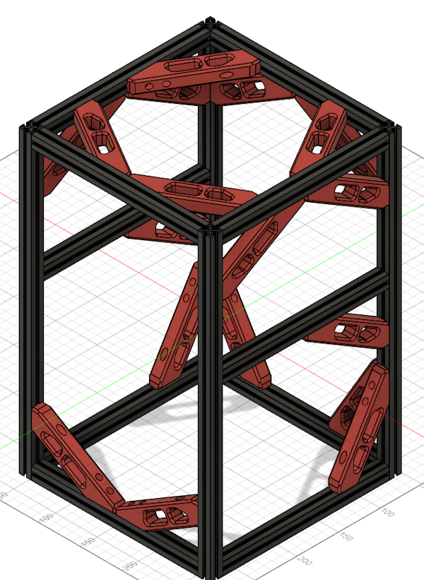

# Crucible

## Source

My take on crucible - [https://github.com/richardjm/Crucible](https://github.com/richardjm/Crucible)

The original v0/trident hybrid by Maverick - [https://github.com/PrintersForAnts/Crucible](https://github.com/PrintersForAnts/Crucible)

My klipper backup is at [https://github.com/richardjm/crucible-klipper-backup](https://github.com/richardjm/crucible-klipper-backup)

- Reduction in branding
- Changed colours (primary, accent, touch)
- Exported STLs
- Stealth skirts
- Stealthbrick beta with Sherpa mini
- Various clip sizes panels
- Smaller hole for screw into plastic idler in a/b mounts
- Sensorless x/y
- Changed base plate dxf
- Voron TAP
- Extrusionless x-gantry
- [Replaced idler (idle_idea)](https://github.com/richardjm/Crucible/tree/main/Usermods/richardjm/idle_idea)
- Tools
  - Drill guides
  - Grantry positioning tool
  - MGN9 1515 rail guide
  - MGN7 1515 rail guide

In the usermods folder:

- [Canbus mount for Mellow fly sht36 v2](https://github.com/richardjm/Crucible/tree/main/Usermods/richardjm/flysht36-mount)
- [Smaller x-carrage for a 17mm pancake motor](https://github.com/richardjm/Crucible/tree/main/Usermods/richardjm/carriage-slimmed)
- [Cover for front of bed](https://github.com/richardjm/Crucible/tree/main/Usermods/richardjm/frond-bed-cover)
- [Beefier left idler](https://github.com/richardjm/Crucible/tree/main/Usermods/richardjm/idler_beefy)
- [Sawtooth led mount](https://github.com/richardjm/Crucible/tree/main/Usermods/richardjm/leds)
- [Pointier rail stops to add range](https://github.com/richardjm/Crucible/tree/main/Usermods/richardjm/pointy-stop)
- [Shorter rear z motor mount](https://github.com/richardjm/Crucible/tree/main/Usermods/richardjm/short-rear-z)
- [UnKlickyNG BFP](https://github.com/richardjm/Crucible/tree/main/Usermods/richardjm/UnKlickyNG)
- [Everywhere Braces](https://github.com/richardjm/Crucible/tree/main/Usermods/richardjm/everywhere-brace)

:::warning
This whole section is a work in progress and likely wrong.
:::

## Z assembly

### Lead screws

- **(3) NEMA17 Stepper Motor w/ integrated lead screw 200mm T8x8**
- (10) m3x30 shcs (bottom z to motors)
- (2) m3x35 shcs (bottom z to rear motor z-chain)
- **(3) m5x16 shcs (ge5c)**
- **(3) m5 nut or nyloc**
- **(3) ge5c x 3**
- (9) m3x6 bhcs (ge5c retainers)
- (4) m3x12 bhcs (leadscrew nut, cut circle)
- (2) m3x14 bhcs + nut (leadscrew nut - rear, full circle)
- (4) m2x6 shcs + washers (to rail)
- (4) m3x10 bhcs + nuts (recommend _no_drop_front_leadscrews.stl_)

TBC - screws for accent plates

### Bed Assembly

- (3) m3x8 bhcs + nuts (fans)
- (2) m3x8 shcs + nuts (rear)
- (4) m3x10 shcs + nuts (left+right)

TBC - screws for accent plates

## Gantry

### AB Motors

Per motor:

- (4) m3x35 shcs (to motor)
- (2) m3x30 shcs + (2) m3x6x0.5 shim (short stack)
- **(5) f623rs + (10) m3x6x0.5 shim**
- (2) m3x40 shcs + nuts (to side extrusion)
- (1) mx3x10 + nut (under mount to side extrusion)

### AB Idleres (idle_idea)

- (4) m3x18 bhcs + heatset inserts (tensioner carrier)
- (4) m3x10 shcs (block to extrusion)
- (4) m3x6x0.5 shim + (4) f623rs + (2) m3x16 + (2) nut (bearing stack)

### AB Idlers (original)

- (2) m3x6 bhcs + nuts (frame)
- (2) m3x10 shcs + nuts (tensioner)
- (2) m3x6x0.5 shim + (2) f623rs + m3x40 + nut (bearing stack)
- (1) m3x25 shcs + heatset insert (tensioning arm)

:::warning
This part is very hard to assemble. I got lucky by re-using some of my v0
extrusions that have a hole in that location I could use a follower to
construct the stack and the push the m3x40 through the tensionsing arm and
bearing stack in one.
The last part attaching the tensioner to the side face of the front.
Good luck.
:::

### XY Joints

- (2) m3 heatset inserts
- (4) m2x6 shcs
- (3) m3x25 shcs
- (2) m3x10 bhcs + nuts
- (1) m3x8 bhcs + nut
- (4) f623rs + m3x6x0.5 shim (4)

### Klicky

:::note
I've since moved to TAP as I'm also using an extrusionless mgn9h
:::

- (2) m3 heatset inserts
- (2) m3x6 + nuts (recommend _no_drop_double_nut.stl_)
- (2) m2x10 screws
- (8) 6x3mm magnets

## Frame

### 200mm extrusions

- (20) m2x10 bhcs (ends of 200mm extrusions)

### Rear

- (2) m3x14 shcs + nuts (middle rear to ab extrusion)
- (2) m3x8 shcs + nuts (middle rear to ab extrusion)
- (1) m3x20 shcs (when using mx3x20 variant)
- (1) m3x10 shcs (rear extrusion to bottom extrusion)

### Bed

- (1) m3x20 bhcs

## Mini Stealthburner

:::note
I'm currently using Stealthbrick beta with TAP and cnc Sherpa Mini
:::

### Mellow Fly SHT36 v2

This is for the "usermod" flysht36-mount.

- (2) m3x8 bhcs
- (2) m3x8 shcs

### 17mm Pancake motor

As I'm using a 17mm pancake motor the x-carriage went on a diet in the
"usermod" carriage-slimmed.

For the -5.95 version.

- (1) m3x10
- (2) m3x40 + nyloc

## Braces (don't do this)

Per brace (There are 18)

- (1) m3x12 shcs
- (1) m3x18 shcs
- (1) m3x20 shcs
- (6) m3 nuts
