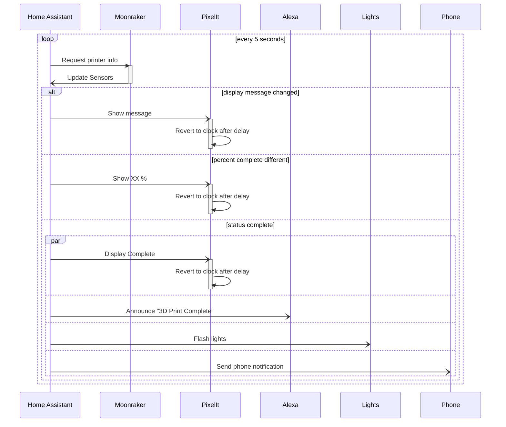

# PixelIt

A matrix display that is integrated to klipper and home assistant.

I designed a custom 3d printed case, the diffuser is actually a sheet of
clear acrylic with some window tint applied on the outside and kitchen
greaseproof paper on the inside.

[https://pixelit-project.github.io/](https://pixelit-project.github.io/)


## Sequence diagram for integration with Klipper via Home Assistant


## Basic commands
```yaml
rest_command:
  pixelit_message:
    url: http://X.X.X.X/api/screen
    method: post
    payload: '{ "text": { "textString": "{{ message | default("Hello") }}", "bigFont": false, "scrollText": "auto", "centerText": false, "color": { "r": {{ red | default(255) }}, "g": {{ green | default(255) }}, "b": {{ blue | default(255) }}} } }'
    content_type: "application/json; charset=utf-8"
  pixelit_brightness:
    url: http://X.X.X.X/api/screen
    method: post
    payload: '{ "brightness": {{brightness | default(50)}} }'
    content_type: "application/json; charset=utf-8"
  pixelit_clock:
    url: http://X.X.X.X/api/screen
    method: post
    payload: '{ "clock": { "show": true, "switchAktiv": {{ switch_active | default(true) }}, "withSeconds": {{ with_seconds | default(false) }}, "switchSec": {{ switch_duration | default(5) }}, "color": { "r": {{ red | default(255) }}, "g": {{ green | default(255) }}, "b": {{ blue | default(255) }}} } }'
    content_type: "application/json; charset=utf-8"

switch:
  - platform: rest
    name: PixelIt Sleep Mode
    resource: http://X.X.X.X/api/screen
    state_resource: http://X.X.X.X/api/matrixinfo
    body_on: '{"sleepMode": "true"}'
    body_off: '{"sleepMode": "false"}'
    is_on_template: "{{ value_json.sleepMode }}"
    headers:
      Content-Type: application/json
```

## Alexa timers
`automation.pixelit_timer`


```yaml
alias: Pixelit Timer
description: ""
trigger:
  - platform: state
    entity_id:
      - sensor.lounge_next_timer
      - sensor.bedroom_clock_next_timer
      - sensor.kitchen_next_timer
      - sensor.workshop_next_timer
    id: next_timer
condition: []
action:
  - repeat:
      while:
        - condition: template
          value_template: >-
            {{ states(trigger.entity_id) != 'unavailable' and
            as_datetime(states(trigger.entity_id)) >= now() }}
      sequence:
        - parallel:
            - delay:
                hours: 0
                minutes: 0
                seconds: 1
            - service: rest_command.pixelit_timer
              data:
                message: >-
                  {{ (today_at("00:00")+(as_datetime(states(trigger.entity_id))
                  - now())).timestamp() | timestamp_custom("%H:%M") if
                  ((today_at("00:00")+(as_datetime(states(trigger.entity_id)) -
                  now())).hour) > 0 else
                  (today_at("00:00")+(as_datetime(states(trigger.entity_id)) -
                  now())).timestamp() | timestamp_custom("%M:%S") }}
                red: 250
                green: 250
                blue: 250
mode: single
```

```yaml
rest_command:
  pixelit_timer:
    url: http://X.X.X.X/api/screen
    method: post
    #payload: '{"bitmapAnimation":{"data":[[0,52857,52857,52857,52857,52857,0,0,0,52857,65504,65504,65504,52857,0,0,0,52857,65504,65504,65504,52857,0,0,0,0,52857,65504,52857,0,0,0,0,0,0,52857,0,0,0,0,0,0,52857,0,52857,0,0,0,0,52857,0,0,0,52857,0,0,0,52857,52857,52857,52857,52857,0,0]]},"text":{"textString":"{{ message | default("00:00") }}","bigFont":false,"scrollText":false,"centerText":false,"position":{"x":10,"y":1},"color":{"r":{{ red | default(255) }},"g":{{ green | default(255) }},"b":{{ blue | default(255) }}}}}'
    payload: '{"bitmap":{"data":[0,52857,52857,52857,52857,52857,0,0,0,52857,53247,53247,53247,52857,0,0,0,52857,53247,53247,53247,52857,0,0,0,0,52857,53247,52857,0,0,0,0,0,0,52857,0,0,0,0,0,0,52857,0,52857,0,0,0,0,52857,0,0,0,52857,0,0,0,52857,52857,52857,52857,52857,0,0],"size":{"width":8,"height":8}},"text":{"textString":"{{ message | default("00:00") }}","bigFont":false,"scrollText":false,"centerText":false,"position":{"x":8,"y":1},"color":{"r":{{ red | default(255) }},"g":{{ green | default(255) }},"b":{{ blue | default(255) }}}}}'
    content_type: "application/json; charset=utf-8"
```

## Display status updates from klipper
Ensure you have the moonraker sensors from [Klipper](klipper)


```yaml
rest_command:
  pixelit_3d_message:
    url: http://X.X.X.X/api/screen
    method: post
    payload: '{"bitmapAnimation":{"data":[[0,0,0,0,0,0,0,0,0,0,0,0,0,0,0,0,0,0,0,0,0,0,0,0,65535,65535,65535,0,0,0,0,0,65535,65535,65535,0,0,0,0,0,65535,65535,65535,0,0,0,0,0,0,65535,0,0,0,0,0,0,0,7616,0,0,0,0,0,0],[0,0,0,0,0,0,0,0,0,0,0,0,0,0,0,0,0,0,0,0,0,0,0,0,0,0,0,0,65535,65535,65535,0,0,0,0,0,65535,65535,65535,0,0,0,0,0,65535,65535,65535,0,0,0,0,0,0,65535,0,0,0,7616,7616,7616,823,823,0,0],[0,0,0,0,0,0,0,0,0,0,0,0,0,0,0,0,0,0,0,65535,65535,65535,0,0,0,0,0,65535,65535,65535,0,0,0,0,0,65535,65535,65535,0,0,0,0,0,0,65535,0,0,0,0,0,0,0,823,0,823,0,0,7616,7616,7616,823,823,0,0],[0,0,0,0,0,0,0,0,65535,65535,65535,0,0,0,0,0,65535,65535,65535,0,0,0,0,0,65535,65535,65535,0,0,0,0,0,0,65535,0,0,0,0,0,0,0,0,0,0,0,0,0,0,0,0,0,7616,823,0,823,0,0,7616,7616,7616,823,823,0,0],[0,0,0,0,0,0,0,0,0,0,0,0,65535,65535,65535,0,0,0,0,0,65535,65535,65535,0,0,0,0,0,65535,65535,65535,0,0,0,0,0,0,65535,0,0,0,0,7616,7616,823,0,0,0,0,0,0,7616,823,0,823,0,0,7616,7616,7616,823,823,0,0],[0,0,0,65535,65535,65535,0,0,0,0,0,65535,65535,65535,0,0,0,0,0,65535,65535,65535,0,0,0,0,0,0,65535,0,0,0,0,0,0,0,823,0,823,0,0,0,7616,7616,823,0,823,0,0,0,0,7616,823,0,823,0,0,7616,7616,7616,823,823,0,0],[65535,65535,65535,0,0,0,0,0,65535,65535,65535,0,0,0,0,0,0,65535,0,0,0,0,0,0,0,7616,0,0,0,0,0,0,0,0,0,7616,823,0,823,0,0,0,7616,7616,823,0,823,0,0,0,0,7616,823,0,823,0,0,7616,7616,7616,823,823,0,0],[0,0,0,0,65535,65535,65535,0,0,0,0,0,65535,65535,65535,0,0,0,0,0,0,65535,0,0,0,7616,7616,7616,823,823,0,0,0,0,0,7616,823,0,823,0,0,0,7616,7616,823,0,823,0,0,0,0,7616,823,0,823,0,0,7616,7616,7616,823,823,0,0],[0,0,0,0,0,0,0,0,0,0,0,0,0,0,0,0,0,0,0,0,0,0,0,0,0,7616,7616,7616,823,823,0,0,0,0,0,7616,823,0,823,0,0,0,7616,7616,823,0,823,0,0,0,0,7616,823,0,823,0,0,7616,7616,7616,823,823,0,0]],"animationDelay":200,"rubberbanding":false,"limitLoops":0}, "text": { "textString": "{{ message | default("Hello") }}", "bigFont": true, "scrollText": "auto", "centerText": false, "color": { "r": {{ red | default(255) }}, "g": {{ green | default(255) }}, "b": {{ blue | default(255) }}} } }'
    content_type: "application/json; charset=utf-8"
```

### M117
`automation.voron_m117`

```yaml
alias: Voron m117
description: ""
trigger:
  - platform: state
    entity_id: sensor.voron2_message
    id: voron2
  - platform: state
    entity_id:
      - sensor.voron0_message
    id: voron0
condition: []
action:
  - choose:
      - conditions:
          - condition: trigger
            id: voron2
          - condition: not
            conditions:
              - condition: state
                entity_id: sensor.voron2_message
                state: Empty
        sequence:
          - service: rest_command.pixelit_3d_message
            data:
              message: "{{ states('sensor.voron2_message') }}"
              red: 250
              green: 250
              blue: 250
      - conditions:
          - condition: trigger
            id: voron0
          - condition: not
            conditions:
              - condition: state
                entity_id: sensor.voron0_message
                state: Empty
        sequence:
          - service: rest_command.pixelit_3d_message
            data:
              message: "{{ states('sensor.voron0_message') }}"
              red: 250
              green: 250
              blue: 250
mode: single
```

### Print progress
`automation.voron_print_progress`

```yaml
alias: Voron print progress
description: ""
trigger:
  - platform: state
    entity_id:
      - sensor.voron2_progress
    id: voron2
  - platform: state
    entity_id:
      - sensor.voron0_progress
    id: voron0
condition: []
action:
  - if:
      - condition: trigger
        id: voron0
    then:
      - service: rest_command.pixelit_3d_message
        data:
          message: "{{ states('sensor.voron0_progress') }}%"
  - if:
      - condition: trigger
        id: voron2
    then:
      - service: rest_command.pixelit_3d_message
        data:
          message: "{{ states('sensor.voron2_progress') }}%"
mode: single
```

### Print complete
`automation.voron_print_complete`

```yaml
alias: "Voron print complete "
description: ""
trigger:
  - platform: state
    entity_id:
      - sensor.voron0_message
    to: Complete
    from: Empty
  - platform: state
    entity_id:
      - sensor.voron2_message
    to: Complete
    from: Empty
condition: []
action:
  - service: script.notify
    data:
      message: 3 D print complete
      colour: Violet
      richard: true
mode: single
```